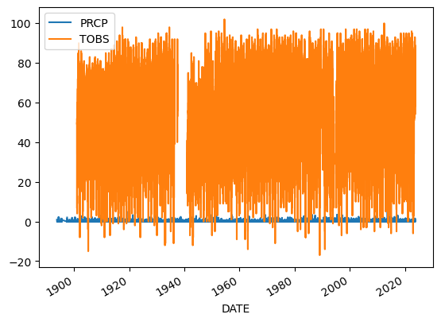
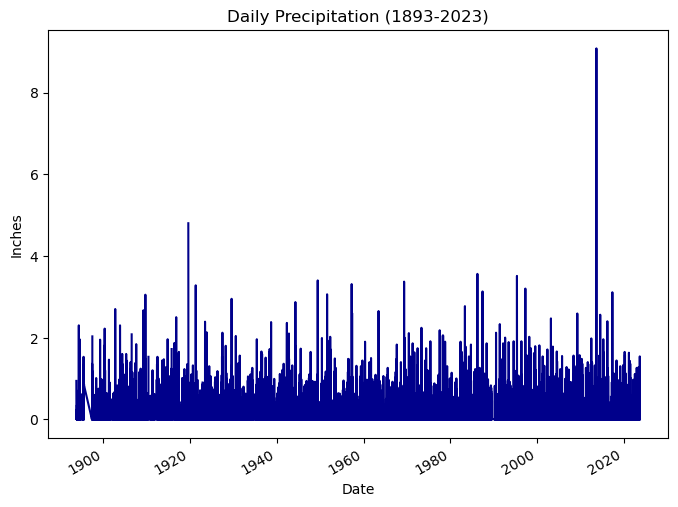
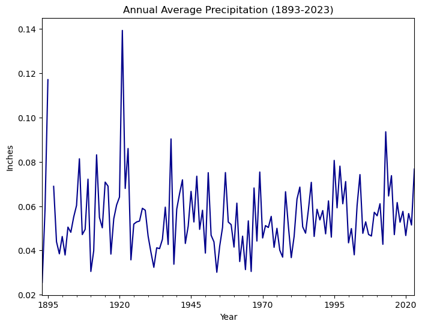

# Part 4: Plot your results

First things first – make sure to load the climate `DataFrame` you
stored in the previous notebooks using Jupyter cell magic:

You’ll also need some libraries later on. This is an extension to
`pandas` that will allow you to easily make beautiful, interactive
plots, and a related library that will let you save your plots:

## Plot the precipitation column (PRCP) vs time to explore the data

Plotting in Python is easy, but not quite this easy:

    <Axes: xlabel='DATE'>

    

    

Looks like we have *both* precipitation and temperature on the same
plot, and it’s hard to see what it is because it’s missing labels!

> ****Label your plot****
>
> <figure>
>  alt="Source: https://xkcd.com/833" />
> <figcaption aria-hidden="true">Source: https://xkcd.com/833</figcaption>
> </figure>
>
> Make sure each plot has:
>
> -   A title that explains where and when the data are from
> -   x- and y- axis labels with **units** where appropriate
> -   A legend where appropriate

When plotting in Python, you’ll always need to add some instructions on
labels and how you want your plot to look.

<link rel="stylesheet" type="text/css" href="./assets/styles.css">

<i class="callout-icon"></i>

Try It: Plot your data

<ol type="1">
<li>Change <code>dataframe</code> to <strong>your</strong>
<code>DataFrame</code> name.</li>
<li>Change <code>y=</code> to the name of your <strong>observed
temperature</strong> column name.</li>
<li>Use the <code>title</code>, <code>ylabel</code>, and
<code>xlabel</code> parameters to add key text to your plot.</li>
<li>Adjust the size of your figure using <code>figsize=(x,y)</code>
where <code>x</code> is figure width and <code>y</code> is figure
height</li>
</ol>
<blockquote>

<strong>HINT:</strong> labels have to be a <em>type</em> in Python
called a <strong>string</strong>. You can make a string by putting
quotes around your label, just like the column names in the sample code
(eg <code>y='TOBS'</code>).

</blockquote>

    <Axes: title={'center': 'Daily Precipitation (1893-2023)'}, xlabel='Date', ylabel='Inches'>

    

    

<link rel="stylesheet" type="text/css" href="./assets/styles.css">

<i class="callout-icon"></i>

Looking for an Extra Challenge?

There are many other things you can do to customize your plot. Take a
look at the <a
href="https://pandas.pydata.org/docs/user_guide/visualization.html">pandas
plotting galleries</a> and the <a
href="https://pandas.pydata.org/docs/reference/api/pandas.DataFrame.plot.html">documentation
of plot</a> to see if there’s other changes you want to make to your
plot. Some possibilities include:

<ul>
<li>Remove the legend since there’s only one data series</li>
<li>Increase the figure size</li>
<li>Increase the font size</li>
<li>Change the colors</li>
<li>Use a bar graph instead (usually we use lines for time series, but
since this is annual it could go either way)</li>
<li>Add a trend line</li>
</ul>

Not sure how to do any of these? Try searching the internet, or
asking an AI!

## Clean up time series plots by resampling

You may notice that your plot looks a little “fuzzy”. This happens when
Python is trying to plot a value for every date, but the resolution of
the image is too low to actually do that. You can address this issue by
**resampling** the data, or summarizing it over a time period of your
choice. In this case, we will resample annually, giving us one data
point per year.

<link rel="stylesheet" type="text/css" href="./assets/styles.css">

<i class="callout-icon"></i>

Try It: Resample

<ol type="1">
<li>Set the frequency of your final data by replacing
<code>DT_OFFSET</code>with a <strong>Datetime Offset Code</strong>.
Check out the table in the <a
href="https://pandas.pydata.org/pandas-docs/stable/user_guide/timeseries.html#dateoffset-objects">pandas
datetime documentation</a> to find the one you want (we recommend the
start of the year).</li>
<li>Choose how to summarize each year of data by replacing
<code>agg_method_here</code> with a method that will calculate the
<strong>average annual value</strong>. Check out the <a
href="https://pandas.pydata.org/pandas-docs/stable/user_guide/timeseries.html#basics">pandas
resampling documentation</a> for a list of common built-in options.</li>
</ol>

<table border="1" class="dataframe">
  <thead>
    <tr style="text-align: right;">
      <th></th>
      <th>PRCP</th>
      <th>TOBS</th>
    </tr>
    <tr>
      <th>DATE</th>
      <th></th>
      <th></th>
    </tr>
  </thead>
  <tbody>
    <tr>
      <th>1893-01-01</th>
      <td>0.025543</td>
      <td>NaN</td>
    </tr>
    <tr>
      <th>1894-01-01</th>
      <td>0.058841</td>
      <td>NaN</td>
    </tr>
    <tr>
      <th>1895-01-01</th>
      <td>0.117090</td>
      <td>NaN</td>
    </tr>
    <tr>
      <th>1896-01-01</th>
      <td>NaN</td>
      <td>NaN</td>
    </tr>
    <tr>
      <th>1897-01-01</th>
      <td>0.068922</td>
      <td>NaN</td>
    </tr>
    <tr>
      <th>...</th>
      <td>...</td>
      <td>...</td>
    </tr>
    <tr>
      <th>2019-01-01</th>
      <td>0.057644</td>
      <td>54.426997</td>
    </tr>
    <tr>
      <th>2020-01-01</th>
      <td>0.046721</td>
      <td>57.691460</td>
    </tr>
    <tr>
      <th>2021-01-01</th>
      <td>0.056658</td>
      <td>57.538462</td>
    </tr>
    <tr>
      <th>2022-01-01</th>
      <td>0.051479</td>
      <td>56.139726</td>
    </tr>
    <tr>
      <th>2023-01-01</th>
      <td>0.076740</td>
      <td>58.996337</td>
    </tr>
  </tbody>
</table>

131 rows × 2 columns

<link rel="stylesheet" type="text/css" href="./assets/styles.css">

<i class="callout-icon"></i>

Try It: Plot Annual Data

<ol type="1">
<li>Try plotting your new DataFrame in the cell below. Can you see what
is going on more clearly now? Don’t forget to adjust your labels!</li>
</ol>

    <Axes: title={'center': 'Annual Average Precipitation (1893-2023)'}, xlabel='Year', ylabel='Inches'>

    

    

<link rel="stylesheet" type="text/css" href="./assets/styles.css">

<i class="callout-icon"></i>

Reflect and Respond: Interpret your plot

<ol type="1">
<li>
Create a new Markdown cell below this one.
</li>
<li>
In the new cell, answer the following questions using a
<strong>bulleted list</strong> in Markdown – what are 2 things you
notice about this data? What physical phenomena or data anomaly could be
causing each one?
</li>
</ol>

- The data does not reach 0.00 inches. This is due to taking the average across all values in a given year.
- There are two outliers above 0.10 inches prior to 1930 which may indicate extreme weather patterns or recording error.

## Check specific values with an interactive plot

You can use the `.hvplot()` method with similar arguments to create an
interactive plot.

<link rel="stylesheet" type="text/css" href="./assets/styles.css">

<i class="callout-icon"></i>

Try It: Interactive Plot

<ol type="1">
<li>Copy your plotting code into the cell below.</li>
<li>Replace <code>.plot</code> in your code with
<code>.hvplot</code></li>
</ol>

Now, you should be able to hover over data points and see their
values!

    WARNING:param.main: hvPlot does not have the concept of a figure, and the figsize keyword will be ignored. The size of each subplot in a layout is set individually using the width and height options.
    /opt/conda/lib/python3.10/site-packages/holoviews/core/data/pandas.py:39: FutureWarning: Series.__getitem__ treating keys as positions is deprecated. In a future version, integer keys will always be treated as labels (consistent with DataFrame behavior). To access a value by position, use `ser.iloc[pos]`
      return dataset.data.dtypes[idx].type
    /opt/conda/lib/python3.10/site-packages/holoviews/core/data/pandas.py:39: FutureWarning: Series.__getitem__ treating keys as positions is deprecated. In a future version, integer keys will always be treated as labels (consistent with DataFrame behavior). To access a value by position, use `ser.iloc[pos]`
      return dataset.data.dtypes[idx].type

  

<link rel="stylesheet" type="text/css" href="./assets/styles.css">

<i class="callout-icon"></i>

Try It: Explore the data

<ol type="1">
<li>
Create a new Markdown cell below this one.
</li>
<li>
Hover over the lowest point on your plot. What is the overall
minimum annual average temperature?
</li>
</ol>

The overall annual minimum is 0.02554.

## BONUS: Save your work

You will need to save your analyses and plots to tell others about what
you find.

<link rel="stylesheet" type="text/css" href="./assets/styles.css">

<i class="callout-icon"></i>

Try It: Save Your Plot

Just like with any other type of object in Python, if you want to
reuse your work, you need to give it a name.

<ol type="1">
<li>Go back to your <code>hvplot</code> code, and give your plot a name
by assigning it to a variable. HINT: if you still want your plot to
display in your notebook, make sure to <strong>call</strong> its name at
the end of the cell.</li>
<li>Replace <code>my_plot</code> with the name you gave to your
plot.</li>
<li>Replace <code>'my_plot.html'</code> with the name you want for your
plot. If you change the file extension, <code>.html</code>, to
<code>.png</code>, you will get an image instead of an interactive
webpage, provided you have the necessary libraries installed.</li>
</ol>

Once you run the code, you should see your saved plot in your files –
go ahead and open it up.

You may need to right-click on your file and download it to be able
to view it.

    /opt/conda/lib/python3.10/site-packages/holoviews/core/data/pandas.py:39: FutureWarning: Series.__getitem__ treating keys as positions is deprecated. In a future version, integer keys will always be treated as labels (consistent with DataFrame behavior). To access a value by position, use `ser.iloc[pos]`
      return dataset.data.dtypes[idx].type
    /opt/conda/lib/python3.10/site-packages/holoviews/core/data/pandas.py:39: FutureWarning: Series.__getitem__ treating keys as positions is deprecated. In a future version, integer keys will always be treated as labels (consistent with DataFrame behavior). To access a value by position, use `ser.iloc[pos]`
      return dataset.data.dtypes[idx].type

    Stored 'ann_climate_df' (DataFrame)

